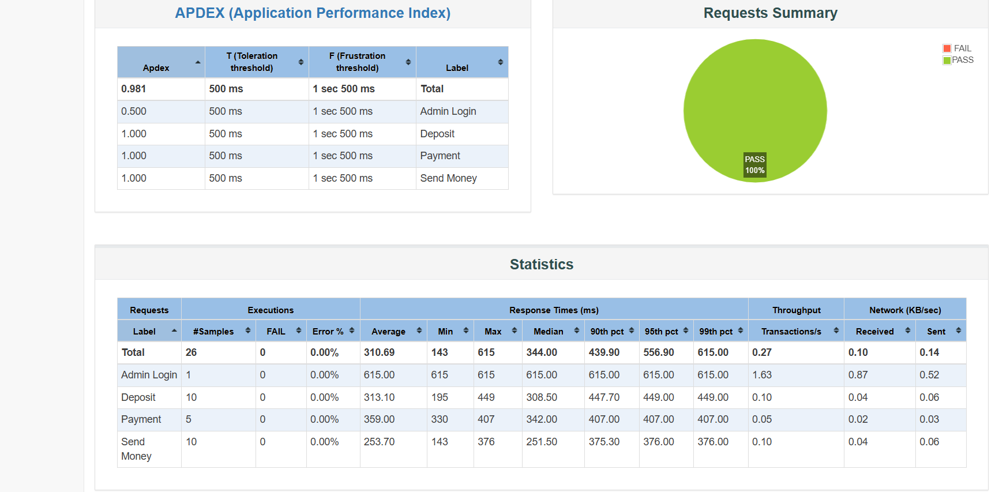

# 💥 JMeter Chaining – DMoney API Simulation 

This project demonstrates **API chaining using Apache JMeter** with the [DMoney API collection](http://dmoney.roadtocareer.net/) to simulate real-world financial transactions between agents, customers, and merchants.

## 📌 Scenario Overview

This simulation performs the following:

- ✅ **5 Agents** perform deposit transactions to **10 Customers**
- ✅ **5 Customers** send money to **10 other Customers**
- ✅ **5 Customers** make payments to **2 Merchants**

All requests use a **single admin login** to generate a token, which is reused across all threads (via **HTTP Header Manager**).

---

## 🔧 Setup Summary

- 🧪 Tool: Apache JMeter 5.6.3
- 🧾 Files:
  - `dmoney.jmx`
  - `deposit.csv`
  - `send_money.csv`
  - `payment.csv`
 
- 🔁 Randomized small transaction amounts to prevent balance exhaustion
- ⏱️ Each thread group:
  - 5 Threads (users)
  - Ramp-up time: 120 seconds
- 📑 Assertions:
  - JSON Response Assertion to validate `successful transaction` 
  
- 📈 Report: Includes screenshots from HTML Summary Report

## 📸 Report Screenshots

---

## ✅ Result

All 3 thread groups executed successfully using separate CSV data. Admin token reused across sessions. Assertions confirmed transaction success.

---
